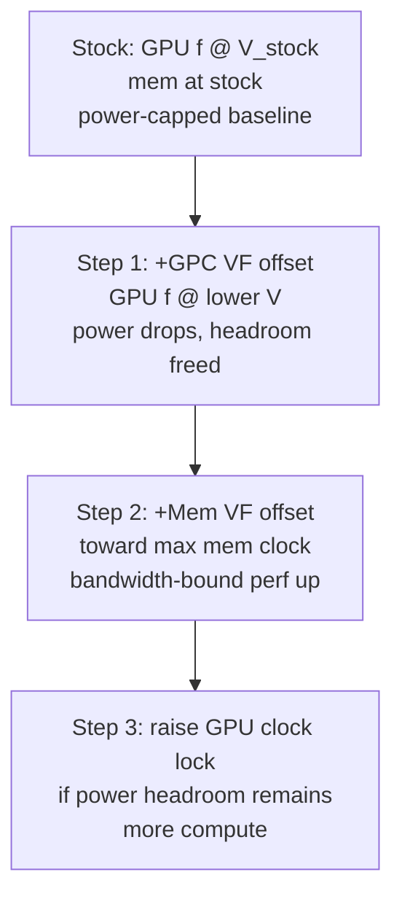

# Undervolting NVIDIA GPUs on Linux via NVML

Goal: **maximize throughput at a fixed power ceiling** by true undervolting
(lower V at fixed f), not just power-capping.

Applies to: modern NVIDIA GPUs on Linux, headless or not. Verified on
RTX PRO 6000 Blackwell Workstation, driver 610.43.02, CUDA 13.3. The same
approach is reported working on RTX 4090, 5090, 3090, and other SKUs
exposing the NVML VF-offset APIs.

---

## 1. What "undervolting" actually means — and a common mistake

- **True undervolting**: run the GPU at a *lower voltage than the V/F curve
  specifies* for a given frequency. Power ∝ V²·f, so dropping V is the
  high-leverage move.
- **Power limiting**: cap total power; the card self-throttles. Not the
  same — the stock V/F curve still applies, so you hit the cap at a
  suboptimal V/f point.
- **Clock locking**: pin frequency. Voltage still follows the stock V/F
  curve. **Not undervolting** — it's operating-point selection. Easy to
  conflate with undervolting; don't.

### Common mistake

`nvidia-smi --set-vf-derate` (negative VF offset) is *one* path to
undervolt, and on many workstation/datacenter SKUs it returns "not
supported". That does **not** mean undervolting is impossible — it just
means that specific path is closed. The NVML VF-offset path (below) is
the one that works.

## 2. The Linux "undervolt via offset" trick

On modern NVIDIA GPUs, the V/F curve is a set of (voltage, max-frequency)
points. Applying a **positive GPU graphics clock offset** shifts the curve
*up* in frequency. At a fixed operating frequency, the card now uses the
voltage originally meant for `(f − offset)` — i.e. lower V at same f.
That is a true undervolt.

Key points (confirmed by multiple independent Linux/Blackwell users):

- **Positive offset = undervolt.** Verified via CachyOS docs, Garuda forum
  (Borodinov, stable at +255 MHz), jacklul/nvml-scripts, Nemophila blog,
  open-gpu-kernel-modules discussion #236 (philipl's canonical explanation).
- **Clock lock matters**: a positive offset would destabilize idle/low
  PSTATEs if allowed to roam (low V at low f can crash). Pin the card to
  its high operating band with a clock lock.
- Linux exposes only a single global offset shape (not the full per-point
  curve editor that MSI Afterburner has on Windows). In practice fine —
  pick a stable max frequency, find the offset that gets you there at
  the lowest V.
- Voltage readout via `nvidia-smi -q -d VOLTAGE` was **broken around
  driver 570+**. On 610 we can't read mV directly. Tune by **power draw
  + stability** instead. (Workaround in some scripts: use an older
  `nvidia-smi` binary against the newer driver.)

## 3. Available levers

Probe your hardware with a read-only NVML script (see Files). Typical
exposure on Blackwell workstation on driver 610:

| Lever | NVML API | Range / notes |
|---|---|---|
| GPU V/F curve offset (undervolt) | `nvmlDeviceSetGpcClkVfOffset` | typically **−1000 .. +1000 MHz**; positive = undervolt |
| Memory V/F curve offset | `nvmlDeviceSetMemClkVfOffset` | typically **−2000 .. +6000 MHz** |
| GPU clock lock | `nvmlDeviceSetGpuLockedClocks` | min/max MHz; keeps card in operating band |
| Memory clock lock | `nvmlDeviceSetMemoryLockedClocks` | runtime switchable; some SKUs expose only one mem point above idle |
| Per-PSTATE offset (newer API) | `nvmlDeviceSetClockOffsets` | future-proof; `SetGpcClkVfOffset` slated for deprecation |
| VF derate (nvidia-smi) | `--set-vf-derate` | often "not supported" on workstation/datacenter SKUs — use NVML instead |
| Voltage readout | `nvidia-smi -q -d VOLTAGE` | broken on driver 570+; tune by power/stability |

Always call the `Get*MinMaxVfOffset` variant first to learn the allowed
range on your specific card before setting anything.

## 4. Implementation paths

### Path A — NVML (preferred)
- Headless, no X server needed.
- Available since driver 555.85.
- Implemented in `jacklul/nvml-scripts`, `weter11/nvidia-offset-controller`,
  LACT (GUI wrapper).
- Bindings: `pynvml` (Python, `pip install nvidia-ml-py`).
- Can target a specific PSTATE (avoids destabilizing idle).

### Path B — `nvidia-settings` + Coolbits + Xorg/Xvfb (fallback)
- The classic Linux path. Requires `Coolbits=28` and a running X server
  (or `Xvfb` on a headless box).
- Equivalent functionality via
  `nvidia-settings -a [gpu:N]/GPUGraphicsClockOffsetAllPerformanceLevels=<mhz>`.
- Use only if Path A is unreliable on your SKU.

## 5. Strategy for bandwidth-bound workloads (e.g. LLM prefill)

The stock boost algorithm already finds a near-optimal GPU-clock operating
point within a given power budget. Limited GPU headroom usually remains.
The high-leverage play for bandwidth-bound workloads:

1. **Undervolt the GPU core** (positive GPC VF offset) → frees power
   budget at the same GPU clock.
2. **Spend the freed budget on memory clock** (positive mem VF offset,
   toward the max supported point) → direct bandwidth gain.
3. **If headroom remains**, raise the GPU clock lock ceiling to let boost
   climb further.



For compute-bound workloads, swap step 2 and step 3: spend the freed
budget on GPU clock first.

## 6. Execution methodology

### Phase 1 — Validate on one card
1. Record baseline: power draw, clocks, temperature, throughput.
2. Lock that card's GPU clocks to a tight high range (e.g.
   `max_boost − 150, max_boost`) — prevents idle-PSTATE crash from the
   offset and keeps the card in its operating band.
3. Apply a small positive GPC VF offset (start ~+30 MHz).
4. Watch ~60 s: power should drop at the same clock. Watch workload
   logs for any fault.
5. Step up in +30 MHz increments until either power stops dropping
   (offset ceiling) or any sign of instability. Back off ~75 MHz from
   the crash point for safety margin.

### Phase 2 — Roll out
6. Apply the validated offset (with the same lock) to the remaining
   cards. **Tune per-card** — silicon variance is real; one offset may
   not fit all cards. Back off any card that faults.
7. Measure throughput. Compare to baseline.

### Phase 3 — Optimize
8. Add memory VF offset in modest steps toward the max supported point.
   Measure after each step.
9. If power headroom remains, raise the GPU clock lock ceiling. Measure.
10. Iterate until either the power budget is saturated or throughput
    stops improving.

## 7. Risks

- **Live workloads**: an unstable undervolt can fault a GPU worker and
  force a model reload. Tune one card at a time, watch logs, keep margin.
- **No voltage readout** on driver 570+ → tune by power draw + stability,
  less precise than targeting a specific mV.
- **Per-card variance** → can't just copy one offset to all cards.
- **Persistence** → NVML offsets don't persist across driver reload;
  need a systemd service to reapply at boot.
- **Microstutters** reported by some users when offsets are applied
  repeatedly on the fly; set once and leave.

## 8. Rollback (all changes reversible instantly)

```bash
# Reset GPC VF offset to 0 on GPU i
sudo python -c "import pynvml; pynvml.nvmlInit(); \
  h=pynvml.nvmlDeviceGetHandleByIndex(i); \
  pynvml.nvmlDeviceSetGpcClkVfOffset(h, 0)"

# Reset Mem VF offset to 0 on GPU i
sudo python -c "import pynvml; pynvml.nvmlInit(); \
  h=pynvml.nvmlDeviceGetHandleByIndex(i); \
  pynvml.nvmlDeviceSetMemClkVfOffset(h, 0)"

# Reset clock locks
sudo nvidia-smi -rgc      # GPU clocks
sudo nvidia-smi -rmc      # memory clocks

# Restore a power cap if you changed it
sudo nvidia-smi -pl <watts>
```

## 9. Files

- `bench/undervolt.md` — this document.
- `nvml_probe.py` (project root) — read-only NVML capability probe.
  Reports allowed VF offset ranges, current offsets, per-PSTATE clock
  ranges, and a live snapshot. Run with
  `sudo python nvml_probe.py [gpu_index]` before touching anything.

## 10. References

- [open-gpu-kernel-modules discussion #236 — Undervolting support](https://github.com/NVIDIA/open-gpu-kernel-modules/discussions/236)
  (philipl's canonical explanation of the offset trick).
- [CachyOS forum — Updating the Nvidia Overclock/Undervolt Docs](https://discuss.cachyos.org/t/updating-the-nvidia-overclock-undervolt-docs/6298)
  (`SetGpcClkVfOffset` deprecation note toward `SetClockOffsets`).
- [CachyOS forum — Undervolting NVIDIA GPU under Wayland and X11](https://discuss.cachyos.org/t/undervolting-nvidia-gpu-under-wayland-and-x11/3293)
  (Borodinov: "positive offset = the actual undervolt").
- [jacklul/nvml-scripts — nvml-undervolt](https://github.com/jacklul/nvml-scripts/tree/master/nvml-undervolt)
  (reference implementation).
- [Folding@Home forum — undervolting a 50xx in Linux](https://forum.foldingathome.org/viewtopic.php?t=43263)
  (long step-by-step; +210 to +240 MHz offset range on 4090, ~30% power
  reduction at ~7% perf loss vs stock).
- [Nemophila blog — Adjusting NVIDIA GPU on Linux](https://blog.nemophila.me/adjusting-nvidia-gpu-on-linux/).
- [ArchWiki — NVIDIA/Tips and tricks](https://wiki.archlinux.org/title/NVIDIA/Tips_and_tricks).
- [Level1Techs — Blackwell RTX 6000 Pro setup guide](https://forum.level1techs.com/t/wip-blackwell-rtx-6000-pro-max-q-quickie-setup-guide-on-ubuntu-24-04-lts-25-04/230521)
  (LACT-based, same SKU family).
